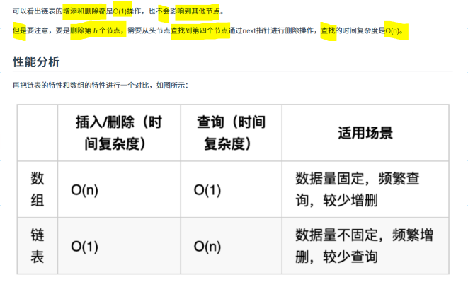
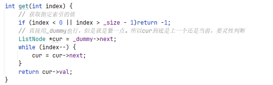

> **链表专题笔记**
>
> 做题过程中随手积累，专题收尾时统一整理。

# 纠正

## 命名

- 英文名是 `Linked List` 而不是 `LinkList`，自定义结构用 `ListNode` 就可以了

## 复杂度

注：看强调方面，删除的整个流程可能是O(n)。

## 虚拟头节点

# 典型方法

- 插入删除用 `pre`+`cur` 冗余了，直接 `cur` +`cur->next` 就够了。不过有些题还是需要双指针，这种一般不是纯 crud 题，比如反转链表
- 即使传参是head，也可以自己在函数里面加dummy，简化逻辑，这样就不用判断head空之类的，这个非常重要，省去大麻烦。所以dummy并不光只是保存返回结果作用，比如强制、无脑返回dummy->next；还有简化、统一代码逻辑的作用
- 画图理解
- 自定义类型可以包含size来简化特殊情形判断，尤其是倒数第k个这种不好想循环退出逻辑的
- 特殊情形比如空链表可以先不管，把代码逻辑写出来后再看看是否已经包含，然后再决定是否要添加if独立判断
