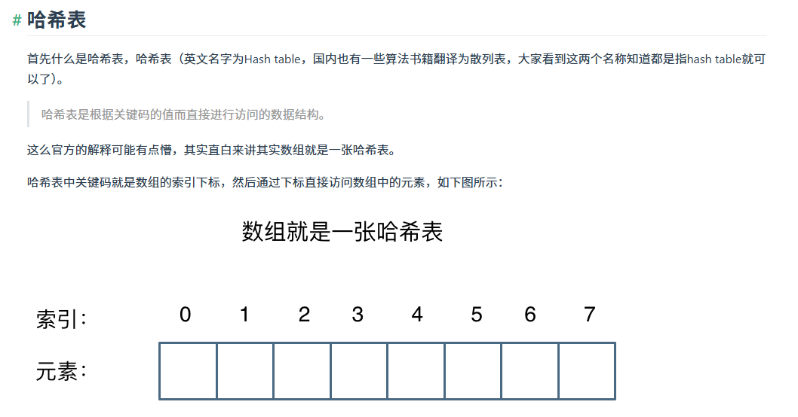
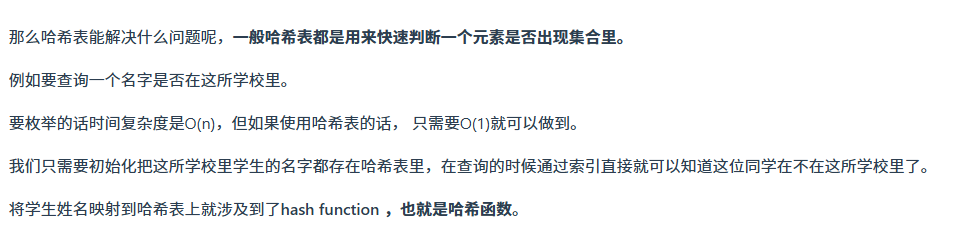
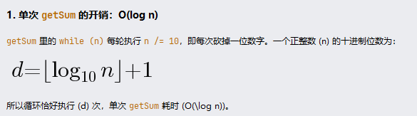
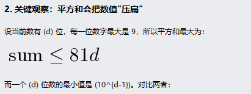
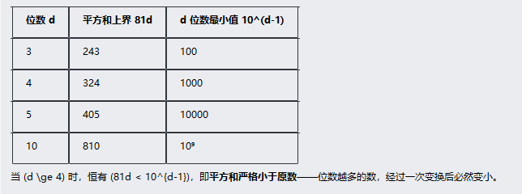
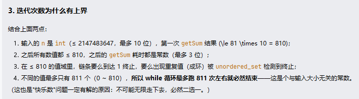
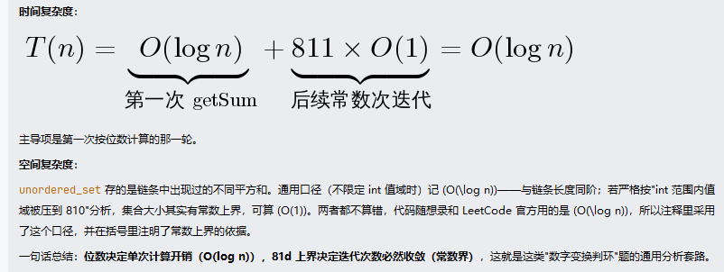

> **哈希表专题笔记**
>
> 做题过程中随手积累，专题收尾时统一整理。

# 哈希表

注：其他内容，包括哈希函数，哈希冲突，解决办法等等都是408学过的，具体见官网，对刷算法题帮助不大。

- 哈希表空间复杂度不一定O(n)，比如26个字母的标记数组

# 典型方法

- 要判断一个元素是否出现在集合里，必须想到哈希
- 注意题目有序无序、能否重复，空间是否过大等等，选择合适的数据结构
- 快慢指针判断循环，不光是链表中有环，还能是结果的循环出现
# 题目回顾

##  leetcode_202_happy_number

### 复杂度推导：

### 总结：

- 分析复杂度从函数或一个过程入手，这里是getSum入手分析时间，然后抽象成d位数，就比如999看成100，取整简化。

- 如果实在不会推导，可以靠排除法+猜，这里肯定不是0(n)，又和平方挂钩，那很可能就是log了，但不绝对，例如408复杂度选择题就有很多反常理。

### 疑问：

空间 O(n) vs O(k)：两者是同一开销的不同口径——O(n) 是最坏上界（nums1 全不重复），O(k) 是精确值（去重后大小），官网写法没错，你的顾虑不成立；
时间分析口径：图里把开销拆成"遍历 nums1 + set 转 vector"偏粗糙，严谨拆法是"构建 set + 遍历 nums2 + 转换"三步，但结论同为 O(m + n)；
为啥不写 max(m, n)：由 max(m,n) <= m+n \<= 2*max(m,n) 可知两者数学等价，你的直觉没错；但多输入问题按惯例写和的形式，能直观体现"每个输入各贡献一份线性开销"，如图算法的 O(V + E)、归并的 O(n + m) 都是这个写法。

