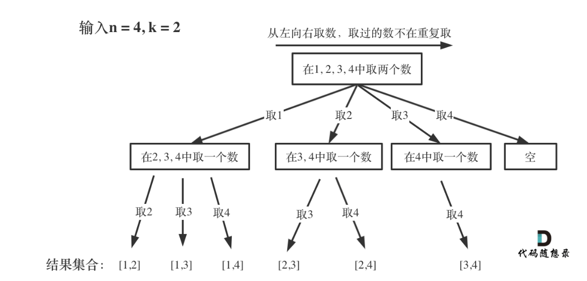

> **回溯算法专题笔记**
>
> 做题过程中随手积累，专题收尾时统一整理。

# 典型方法

## 回溯法模板

```cpp
void backtracking(参数) {
    if (终止条件) {
        存放结果;
        return;
    }

    for (选择：本层集合中元素（树中节点孩子的数量就是集合的大小）) {
        处理节点;
        backtracking(路径，选择列表); // 递归
        回溯，撤销处理结果
    }
}
```

> 任何回溯法解答的题目都可以抽象为树形结构，剪枝一词由此而来。树形遍历与递归挂钩，所以回溯依托递归算法。以两数组合为例：
>
> 
