> **通用笔记**
>
> 跨专题的积累：C++ 前置知识、工具链、通用方法论。
> 各专题的心得记录在对应目录的 `NOTES.md` 中。

# 基本

## 力扣相关

## CPU 地址位数与最值位数无关

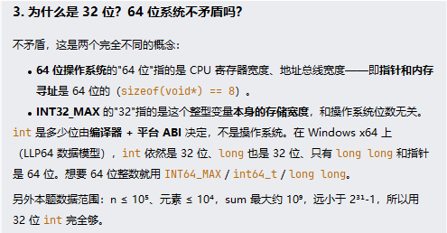

# C++	

## 头文件

### 万能头文件

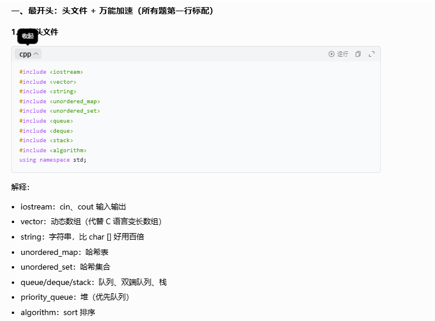

### 最值头文件

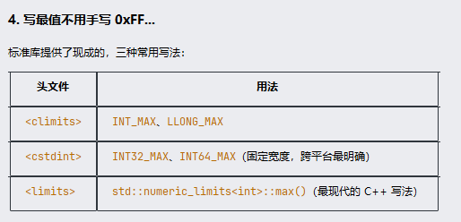

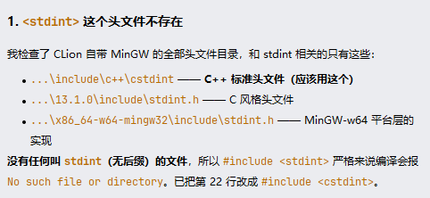

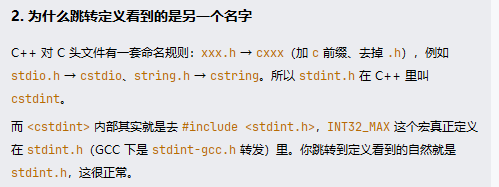

## STL

### vector 

#### 常用成员

`size()`；`erase()` 是 O(n)。

#### 二维数组

## IO

### 加速

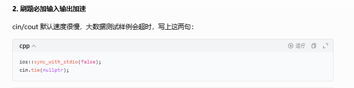

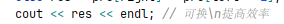

### ACM格式的IO

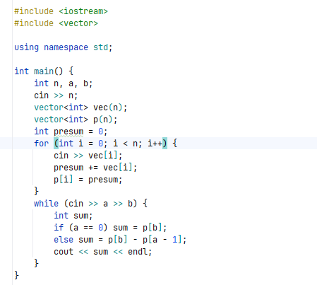

注：io写在while里比较新奇。

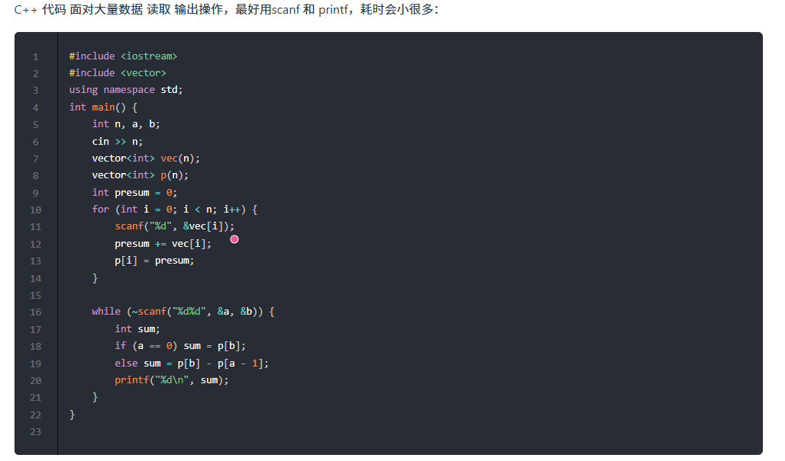

注：别写成%d %d，不然匹配任意空白字符就G了，因为必须输入非法字符才能到下一次，比如a,b。

## 结构体

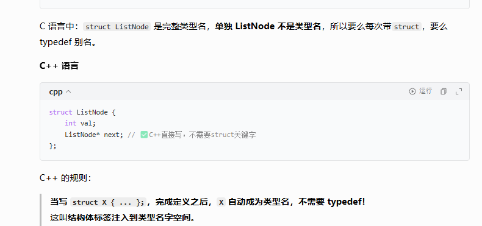

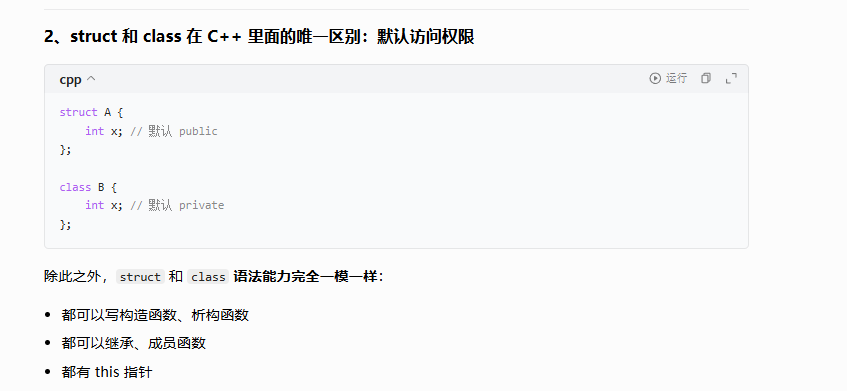

注：力扣不用后者就是因为默认私有外部方法没法访问。

## 禁用拷贝

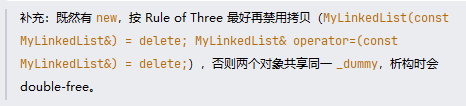

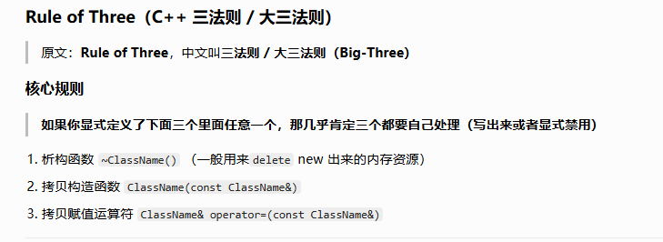

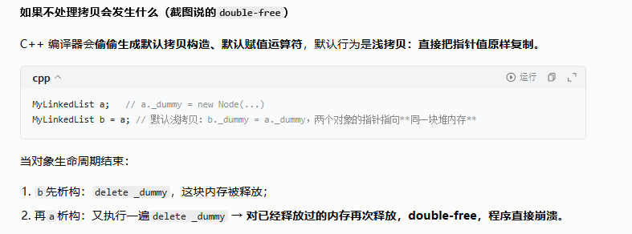

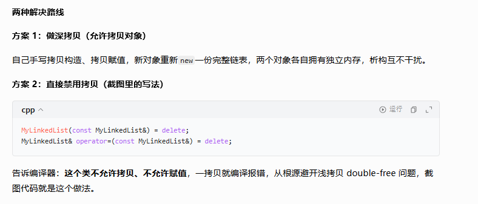

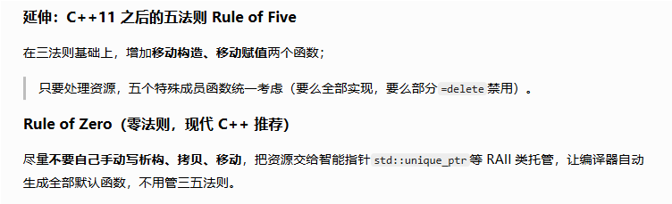

## 指针

### 野指针

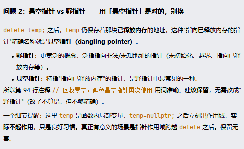

### 空指针

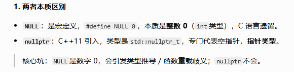

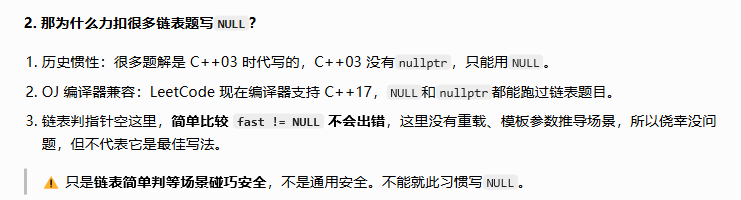

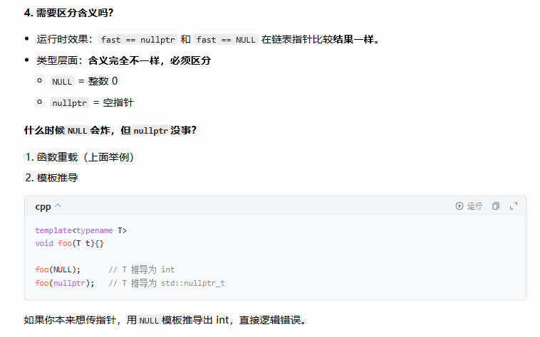

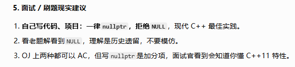

# CLion相关 

## 如何运行

### ide

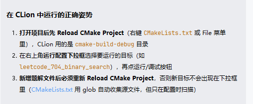

### cmd

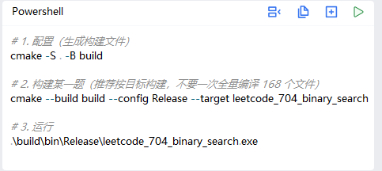

注：尽量不要中文名，MSVC可以构建，但要配置什么utf。MinGW直接就是失败。

## 快捷键

### 运行

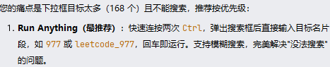

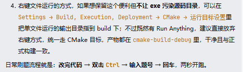

### 编辑

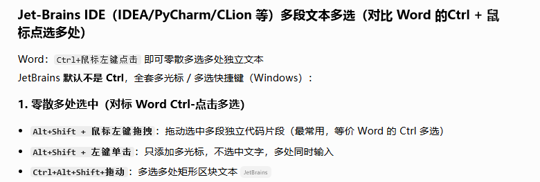

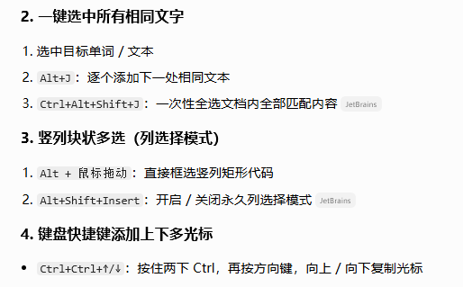

### 项目

ctrl+alt+enter 在上方插入空行

### 自定义

## 其他设置

### md预览

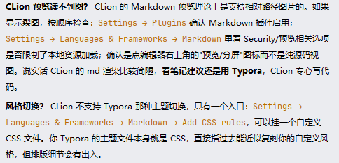

# 其他

## commit风格

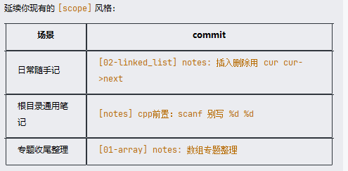

即[xxx] xxx的提交格式。

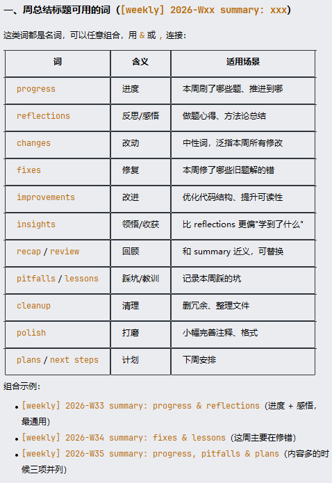

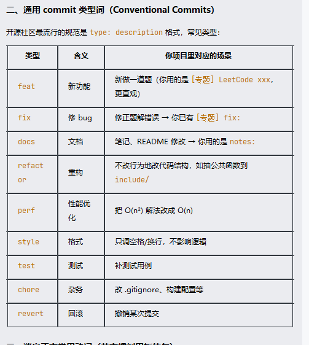

## 金句

- 一入循环深似海，从此 offer 是路人
- 抓住循环不变式，否则做题就是个死循环
