> **通用笔记**
>
> 跨专题的积累：C++ 前置知识、工具链、通用方法论。
> 各专题的心得记录在对应目录的 `NOTES.md` 中。

# 基本

## 力扣相关

## CPU 地址位数与最值位数无关

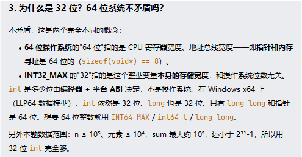

# C++	

## 头文件

### 万能头文件

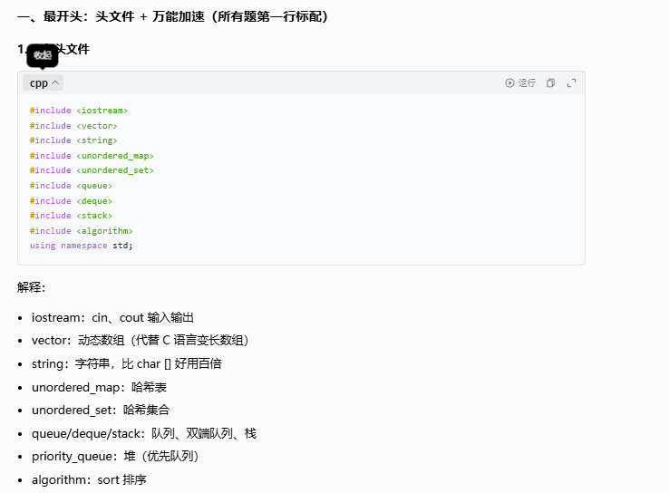

### 最值头文件

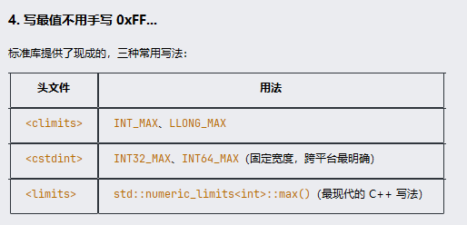

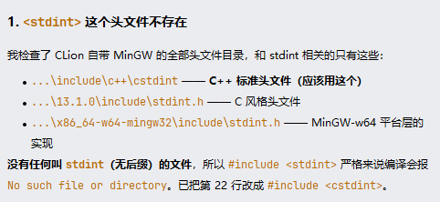

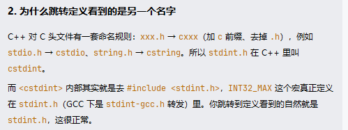

## STL

### vector 

#### 常用成员

`size()` 是O(1)；`erase()` 是 O(n)；

#### 二维数组

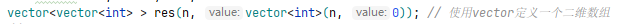

### string

#### 常用成员

`size()` 是O(1)；

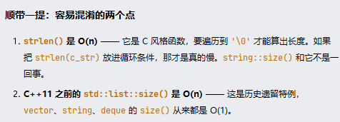

### 哈希相关

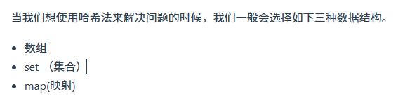

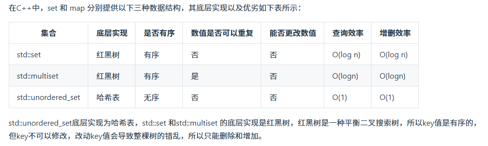

当我们要使用集合来解决哈希问题的时候，优先使用**unordered_set**，因为它的查询和增删效率是最优的，如果需要集合是有序的，那么就用set，如果要求不仅有序还要有重复数据的话，那么就用multiset。

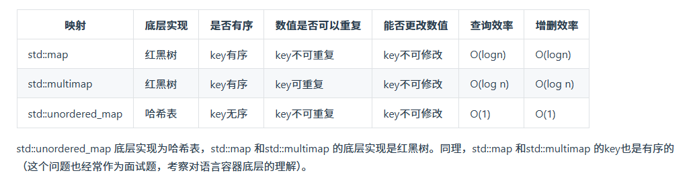

那么再来看一下map ，在map 是一个key value 的数据结构，map中，对key是有限制，对value没有限制的，因为key的存储方式使用红黑树实现的。优先使用**unordered_map**。

其他语言例如：java里的HashMap ，TreeMap 都是一样的原理。可以灵活贯通。

虽然std::set和std::multiset 的底层实现基于红黑树而非哈希表，它们通过红黑树来索引和存储数据。不过给我们的使用方式，还是哈希法的使用方式，即依靠键（key）来访问值（value）。所以使用这些数据结构来解决映射问题的方法，我们依然称之为哈希法。std::map也是一样的道理。

#### 补充

这里在说一下，一些C++的经典书籍上 例如STL源码剖析，说到了hash_set hash_map，这个与unordered_set，unordered_map又有什么关系呢？

实际上功能都是一样一样的， 但是unordered_set在C++11的时候被引入标准库了，而hash_set并没有，所以建议还是使用unordered_set比较好，这就好比一个是官方认证的，hash_set，hash_map 是C++11标准之前民间高手自发造的轮子。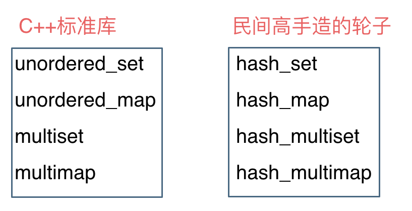

## IO

### 加速

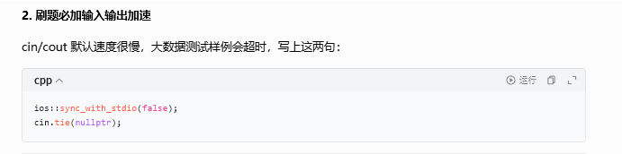

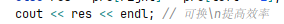

### ACM格式的IO

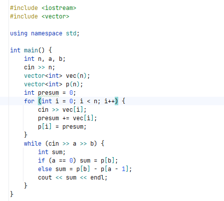

注：io写在while里比较新奇。

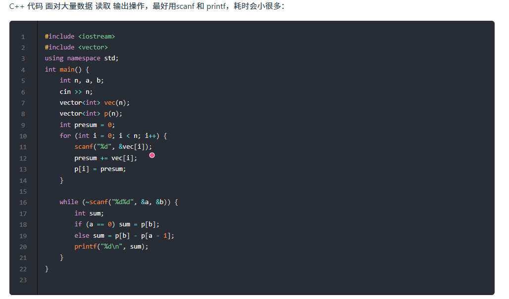

注：别写成%d %d，不然匹配任意空白字符就G了，因为必须输入非法字符才能到下一次，比如a,b。

## 结构体

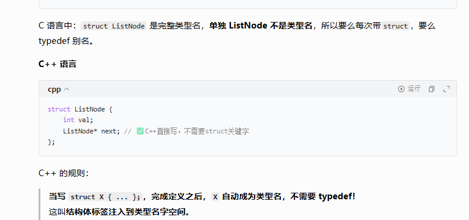

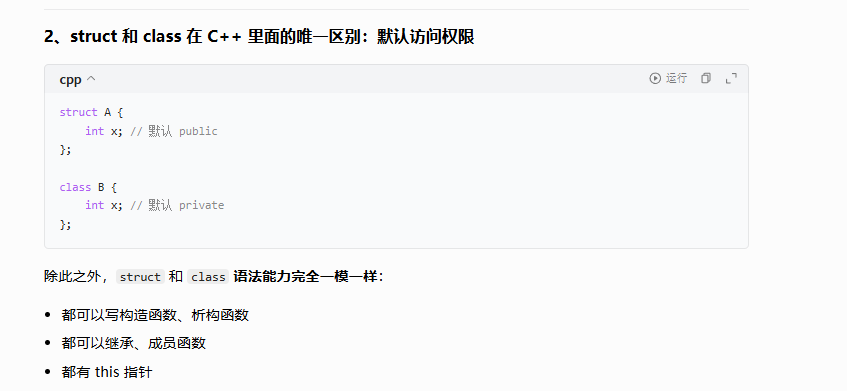

注：力扣不用后者就是因为默认私有外部方法没法访问。

## 禁用拷贝

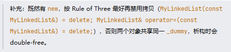

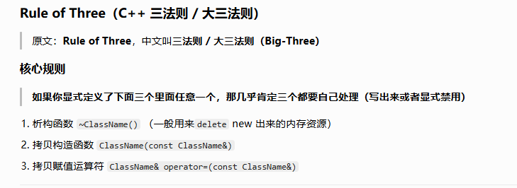

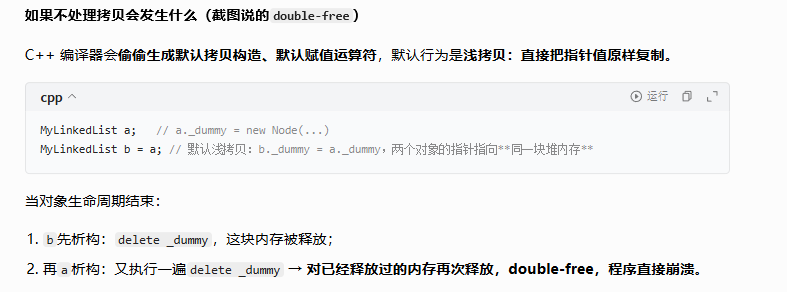

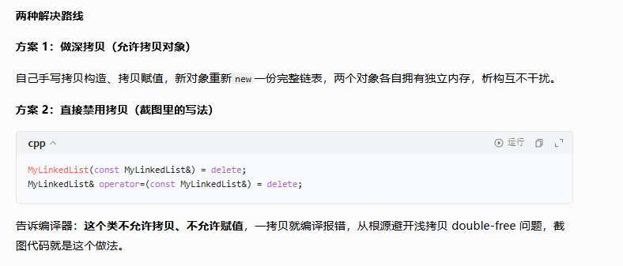

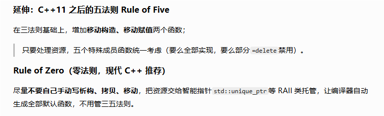

## 指针

### 野指针

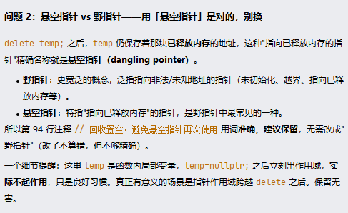

### 空指针

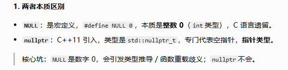

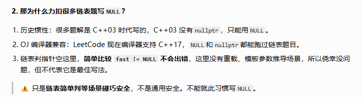

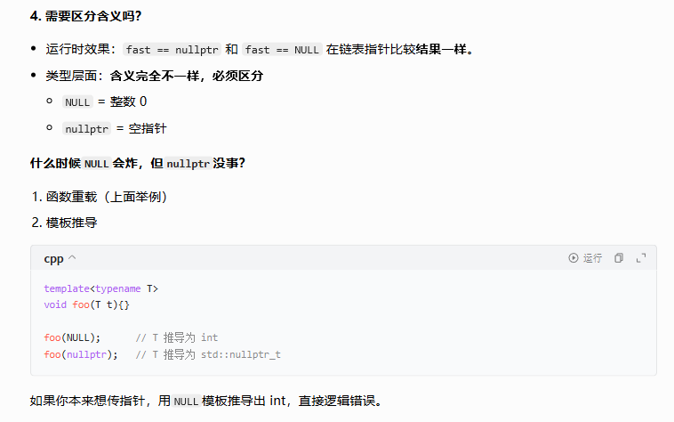

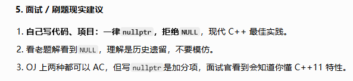

# CLion相关 

## 如何运行

### ide

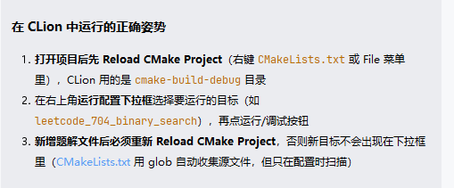

### cmd

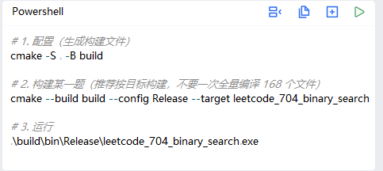

注：尽量不要中文名，MSVC可以构建，但要配置什么utf。MinGW直接就是失败。

## 快捷键

### 运行

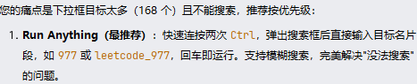

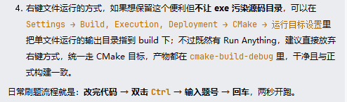

### 编辑

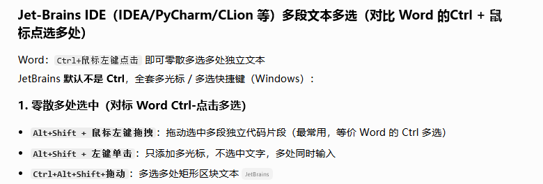

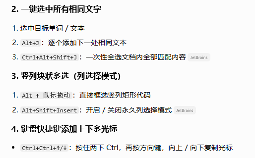

### 项目

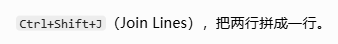

ctrl+alt+enter 在上方插入空行

### 自定义

## 其他设置

### md预览

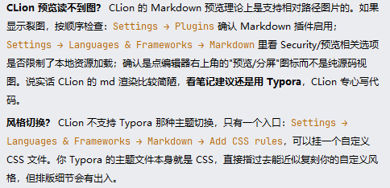

# 其他

## commit风格

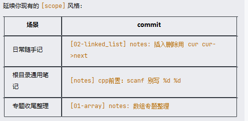

即[xxx] xxx的提交格式。

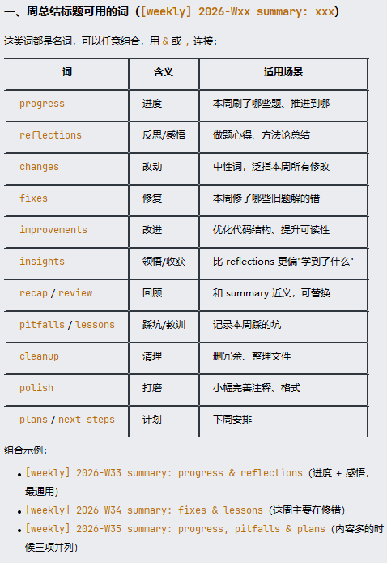

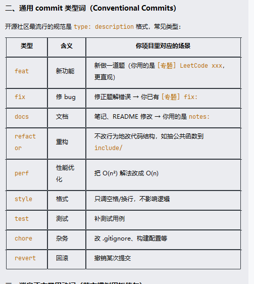

## 金句

- 一入循环深似海，从此 offer 是路人
- 抓住循环不变式，否则做题就是个死循环
