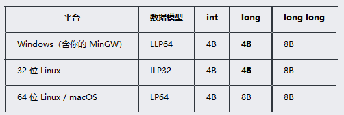
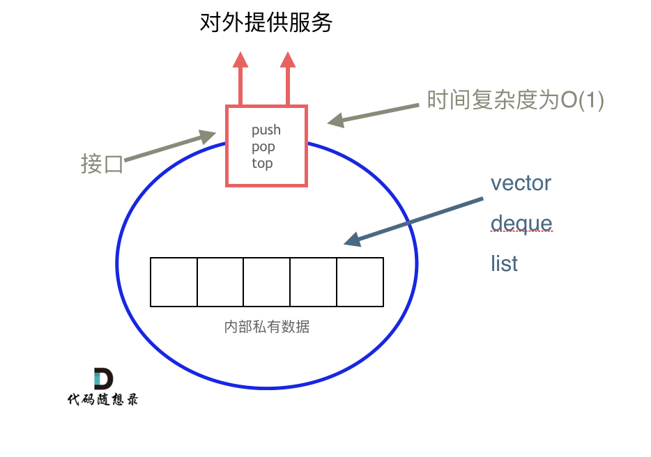
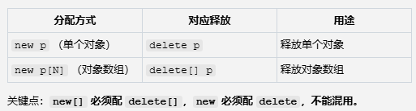

> **通用笔记**
>
> 跨专题的积累：C++ 前置知识、工具链、通用方法论。
> 各专题的心得记录在对应目录的 `NOTES.md` 中。

# 基本

## 力扣相关


## CPU 地址位数与最值位数无关


e## long整型

### long可能和 int 同范围

C++ 标准只规定最小位宽：int ≥ 16 位，long ≥ 32 位，long long ≥ 64 位。具体多大取决于平台的数据模型：



所以在 Windows 和 32 位 Linux 上 long 确实和 int 一样都是 4 字节，用 long 接四数之和照样溢出；只有 long long（标准保证 ≥ 64 位）在所有平台都安全。

### 小巧思

标准 C++ 里没有 `ll` 这个类型，直接写 `ll sum = ...`; 编译不过。`ll` 相关的合法用法只有两种：

1. 字面量后缀：`0LL`、`5ll`（大小写均可）。
2. 竞赛代码里的自定义别名：typedef long long ll; 或 using ll = long long;，这是手写出来的别名，不是语言内置的。

## 前缀后缀

前缀表：包含首元素，**不**包含尾元素的组合。比如str:abc，前缀表：a,ab

后缀表则反之。

# C++	


## 头文件

### 万能头文件


### 最值头文件


### 算法头文件

标准归属头文件是 <utility>。此外 C++11 起标准规定 <algorithm> 会包含 <utility>，所以包含 <algorithm> 也能可靠地用到类似 std::swap，sort等方法。

## STL

### vector 

#### 常用成员

`size()` 是O(1)；`erase()` 是 O(n)；

#### 二维数组


### string

#### 常用成员

`size()` 是O(1)；


### 哈希相关


当我们要使用集合来解决哈希问题的时候，优先使用**unordered_set**，因为它的查询和增删效率是最优的，如果需要集合是有序的，那么就用set，如果要求不仅有序还要有重复数据的话，那么就用multiset。


那么再来看一下map ，在map 是一个key value 的数据结构，map中，对key是有限制，对value没有限制的，因为key的存储方式使用红黑树实现的。优先使用**unordered_map**。

其他语言例如：java里的HashMap ，TreeMap 都是一样的原理。可以灵活贯通。

虽然std::set和std::multiset 的底层实现基于红黑树而非哈希表，它们通过红黑树来索引和存储数据。不过给我们的使用方式，还是哈希法的使用方式，即依靠键（key）来访问值（value）。所以使用这些数据结构来解决映射问题的方法，我们依然称之为哈希法。std::map也是一样的道理。

#### 补充

这里在说一下，一些C++的经典书籍上 例如STL源码剖析，说到了hash_set hash_map，这个与unordered_set，unordered_map又有什么关系呢？

实际上功能都是一样一样的， 但是unordered_set在C++11的时候被引入标准库了，而hash_set并没有，所以建议还是使用unordered_set比较好，这就好比一个是官方认证的，hash_set，hash_map 是C++11标准之前民间高手自发造的轮子。

### 栈与队列

思考四个问题：

1. C++中stack 是容器么？
2. 我们使用的stack是属于哪个版本的STL？
3. 我们使用的STL中stack是如何实现的？
4. stack 提供迭代器来遍历stack空间么？

相信这四个问题并不那么好回答，有的同学可能仅仅知道有栈和队列这么个数据结构，却不知道底层实现，也不清楚所使用栈和队列和STL是什么关系。

---

首先大家要知道 栈和队列是STL（C++标准库）里面的两个数据结构。

那么来介绍一下，三个最为普遍的STL版本：

1. HP STL 其他版本的C++ STL，一般是以HP STL为蓝本实现出来的，HP STL是C++ STL的第一个实现版本，而且开放源代码。
2. P.J.Plauger STL 由P.J.Plauger参照HP STL实现出来的，被Visual C++编译器所采用，不是开源的。
3. SGI STL 由Silicon Graphics Computer Systems公司参照HP STL实现，被Linux的C++编译器GCC所采用，SGI STL是开源软件，源码可读性甚高。

接下来介绍的栈和队列也是SGI STL里面的数据结构， 知道了使用版本，才知道对应的底层实现。

---

栈提供push 和 pop 等等接口，所有元素必须符合先进后出规则，所以栈不提供走访功能，也不提供迭代器(iterator)。 不像是set 或者map 提供迭代器iterator来遍历所有元素。

**栈是以底层容器完成其所有的工作，对外提供统一的接口，底层容器是可插拔的（也就是说我们可以控制使用哪种容器来实现栈的功能）。**

所以STL中栈往往不被归类为容器，而被归类为container adapter（容器适配器）。

那么问题来了，STL 中栈是用什么容器实现的？

从下图中可以看出，栈的内部结构，栈的底层实现可以是vector，deque，list 都是可以的， 主要就是数组和链表的底层实现。



**我们常用的SGI STL，如果没有指定底层实现的话，默认是以deque为缺省情况下栈的底层结构。**

deque是一个双向队列，只要封住一端，只开通另一端就可以实现栈的逻辑了。

我们也可以指定vector为栈的底层实现，初始化语句如下：

```cpp
std::stack<int, std::vector<int> > third;  // 使用vector为底层容器的栈
```

队列中先进先出的数据结构，同样不允许有遍历行为，不提供迭代器, **SGI STL中队列一样是以deque为缺省情况下的底部结构。**

也可以指定list 为起底层实现，初始化queue的语句如下：

```cpp
std::queue<int, std::list<int>> third; // 定义以list为底层容器的队列
```

所以STL 队列也不被归类为容器，而被归类为container adapter（ 容器适配器）。

> 这里是C++ 语言中的情况， 使用其他语言的同学也要思考栈与队列的底层实现问题， 不要对数据结构的使用**浅尝辄止**，而要**深挖其内部原理**，才能**夯实基础**。

> [!Note]
>
> 注意不要对空栈pop等越界操作，需要if !empty拦截

### 队列补充

#### deque

全称：`double‑ended queue`，**双端队列容器**

头文件：`#include <deque>`

- 是**标准容器**，可以在**头部、尾部**高效增删元素，也支持随机访问 `[]`。

#### queue

全称：队列，**容器适配器**，不是独立容器

头文件：`#include <queue>`

- 默认底层就是用 `deque` 实现的！
- 适配器：**对底层容器做了一层限制，只允许先进先出 (FIFO)**。

| 特性          | deque                              | queue                              |
| ------------- | ---------------------------------- | ---------------------------------- |
| 数据结构      | 双端队列                           | 单向队列 (FIFO 先进先出)           |
| 头插          | `push_front()` ✅                   | 不能 `push_front`                  |
| 尾插          | `push_back()` ✅                    | `push()`(只能加到队尾)             |
| 头部删除      | `pop_front()` ✅                    | `pop()`(只能删掉队头)              |
| 尾部删除      | `pop_back()` ✅                     | **不能 pop_back**                  |
| 访问队头      | `front()`                          | `front()`                          |
| 访问队尾      | `back()`                           | `back()`                           |
| 随机访问 `[]` | ✅ 支持                             | ❌ 不支持！不能访问中间元素         |
| 遍历迭代器    | ✅ `begin() / end()`，可以 for 遍历 | ❌ **没有迭代器，不能遍历队列内部** |

## IO

### 加速


### ACM格式的IO


> 注：io写在while里比较新奇。


> 注：别写成%d %d，不然匹配任意空白字符就G了，因为必须输入非法字符才能到下一次，比如a,b。

## 结构体


> 注：力扣不用后者就是因为默认私有外部方法没法访问。

## 禁用拷贝


## 指针

### 野指针


### 空指针


## 分配空间



# CLion相关 

## 如何运行

### ide


### cmd


> 注：尽量不要中文名，MSVC可以构建，但要配置什么utf。MinGW直接就是失败。

## 快捷键

### 运行


### 编辑


### 项目


ctrl+alt+enter 在上方插入空行

### 自定义


## 其他设置

### md预览


# 其他

## commit风格


即[xxx] xxx的提交格式。


## 金句

- 一入循环深似海，从此 offer 是路人
- 抓住循环不变式，否则做题就是个死循环
- 还记得梦开始和破碎的地方是哪里吗
